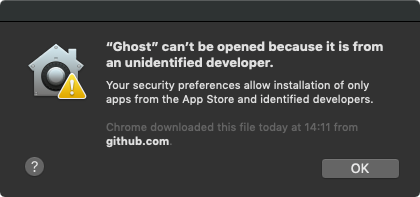
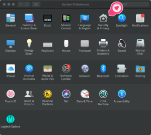
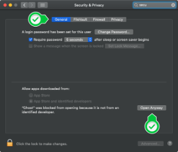

# Ghost 


### Welcome

<p>
  This is <b>Ghost</b>, an electron app for code quality analysis through git.
</p>
<p>
  Just enter a branchname or branchtype you want to analyse and select your .git-repository.<br>
  Ghost will show all file occurrence within these branches and provide statistics for you.

If you want to search for a specific file type only, type the file extension(s) in the second textbox like this: js,jsx,json and so on.

</p>
<p>
  Come and join our discord https://discord.gg/JjereDw
</p>

## About the project

<p>
As mentioned above Ghost is an analysing tool for git branches. The main purpose is to identify files which are relatively often part of bugfixes. This suggests that those files should be refactored.
</p>

## How to install Win + Linux

<p> There are no special install instructions for windows and linux</p>

## How to install (MacOS)

<p> When you first download and install Ghost a warning message will appear, telling you that the application is from an unidentified dev and therefore can't be opened. </p>



<p> Until we get an open source license a work around is needed to install Ghost: <br>
Go to your settings menu and select 'security & privacy'. In the 'General' Tab a note at the bottom will tell you, that the installation has been blocked. Tap the button 'Open Anyway' to allow the installation. </p>




## Initialize

To load project dependencies open the project folder in the terminal and type

```bash
$ yarn install
```

## Development

Starting ghost in development mode

```bash
$ yarn dev
```

Sometimes strange errors occur. Make sure you run and restart the app. This leads to the partial rebuilding of electron.

```bash
$ yarn install --force
```

## Production mode and packaging app

Package the web content

```bash
$ yarn production
```

if you run into errors check if you have everything for your plattform: https://github.com/nodejs/node-gyp

### Testing

Run tests

```bash
$ yarn test
```

If you come across a bug, please tell us in the issues tab.
Feel free to leave suggestions and feedback.

