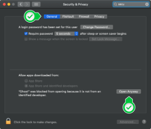

# Ghost


### Welcome

<p>
  This is <b>Ghost</b>, an electron app for code quality analysis through git.
</p>
<p>
  Just enter a branchname or branchtype you want to analyse and select your .git-repository.<br>
  Ghost will show all file occurrence within these branches and provide statistics for you.
</p>

## About the project

<p>
As mentioned above Ghost is an analysing tool for git branches. The main purpose is to identify files which are relatively often part of bugfixes. This suggests that those files should be refactored.
</p>

## How to install

<p> When you first download and install Ghost a warning message will appear, telling you that the application is from an unidentified dev and therefore can't be opened. </p>


<p> Until we get an open source license a work around is needed to install Ghost: <br>
Go to your settings menu and select 'security & privacy'. In the 'General' Tab a note at the bottom will tell you, that the installation has been blocked. Tap the button 'Open Anyway' to allow the installation. </p>




## Initialize

To load project dependencies open the project folder in the terminal and type

```bash
$ yarn install
```

## Development

Run local web development server

```bash
$ yarn dev
```

Start the electron development

```bash
$ yarn start-dev
```

## Production mode and packaging app

Package the web content

```bash
$ yarn build
```

Package and create the app

```bash
$ yarn dist
```

### Testing

Before testing, change nodeIntegration to true in main.js

run local web dev server

```bash
$ yarn dev
```

Run tests

```bash
$ yarn test
```

If you come across a bug please tell as in the issues tab.
Feel free to leave suggestions and feedback.

